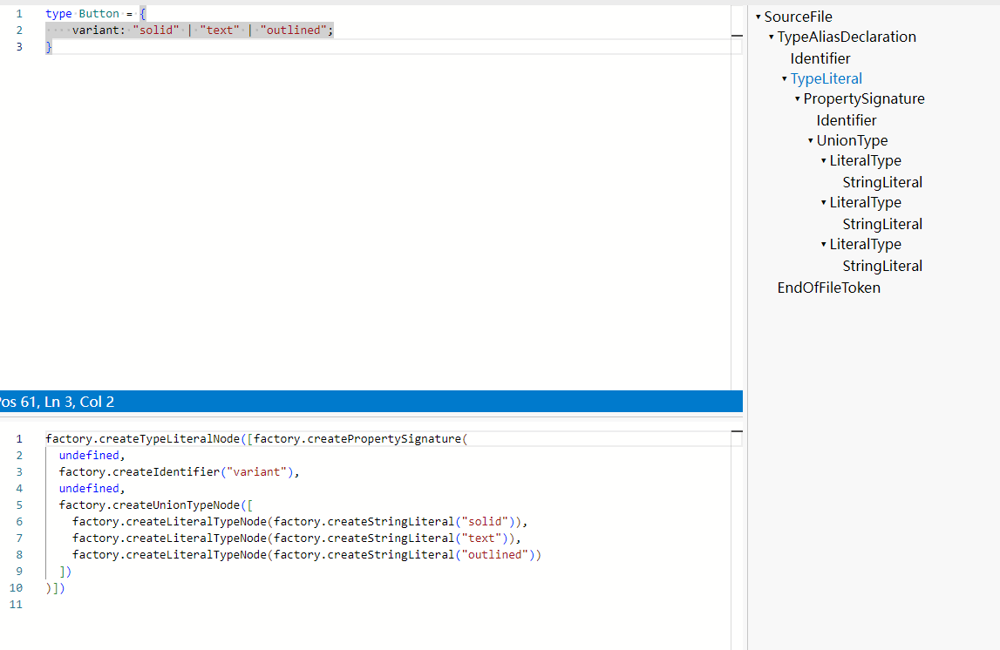
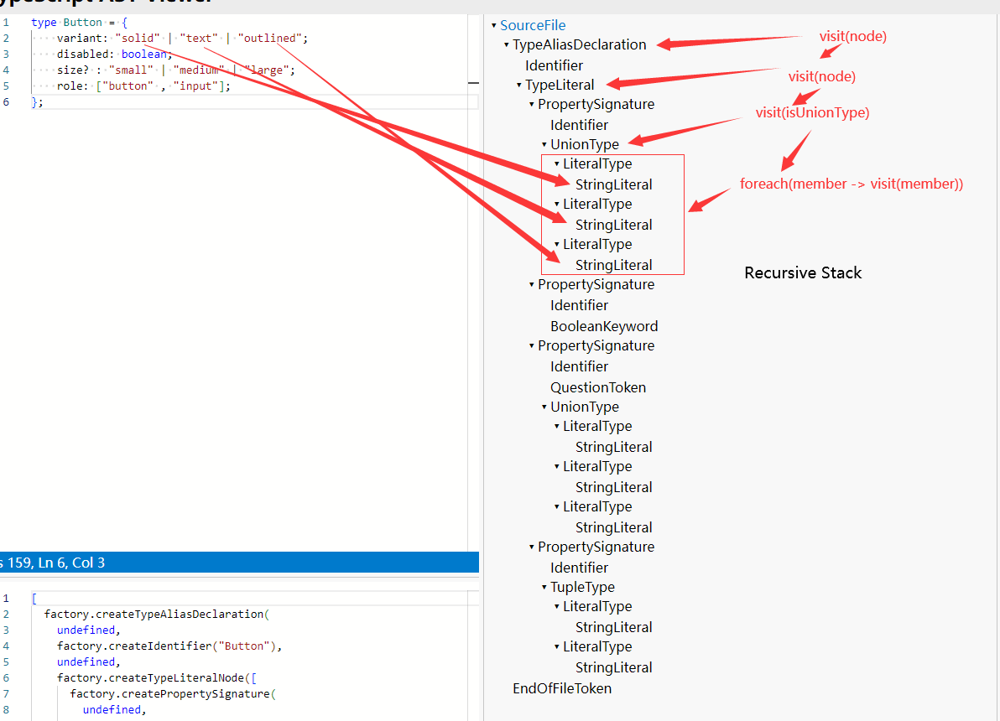

# TypeScript Compiler Project

## Overview

This project is a TypeScript compiler that converts TypeScript type definitions into JavaScript object literals using standard Typescript compiler api. It started with the `createSourceFile` API from the TypeScript Compiler API and involved debugging to observe the structure of a standardized `typeStr` input.

## Prerequisites

- Node.js installed on your system.
- TypeScript installed globally or in the project.

## How to run application using npx ts-node

This method needs `ts-node` installed.

You can run the application using the following command:

```bash
npx ts-node src/index.ts --input-file path/to/input-file [--output-file path/to/output-file]
```

`--input-file:` The path to the TypeScript file containing the type definitions you want to convert.

`--output-file (optional): `The path where you want to save the converted JavaScript object. If not provided, the output will be printed to the console.

### Example:

To convert a file and print the result to the console:

```bash
npx ts-node src/index.ts --input-file your-input-file-path
```

To convert a file and save the result to a file:

```bash
npx ts-node src/index.ts --input-file your-input-file-path --output-file your-output-file-path
```

<!-- sample-input-anchor -->

### Using sample input

If you do not want to define some input, you can use the sample inputs inside `public/resources` directory
If you want to see the result in console, you can run:

```bash
npx ts-node src/index.ts -- --input-file public/resources/sample-interface-input.txt
```

you should be able to see the following output in your console

```bash
Converted object: {
  "Button": {
    "variant": [
      "solid",
      "text"
    ],
    "array": "Array",
    "size?": [
      "small",
      "large"
    ],
    "onClick": "function",
    "disabled": "boolean"
  }
}
```

If you want to see the result into a file, you can run

```bash
npx ts-node src/index.ts -- --input-file public/resources/sample-interface-input.txt --output-file public/resources/sample-interface-output.txt
```

You should be able to see a file under the `public/resources` with content same with the output above.

## How to run application using node (alternative method)

If you want to use compiled javascript file to run the application, you can run

```bash
npx tsc
```

You should be able to see `compiled/index.js` added under the project root directory

Then using nodejs, run command in terminal

```bash
node compiled/index.js --input-file path/to/input-file.ts [--output-file path/to/output-file.json]
```

Please refer to the [sample input section](#sample-input-anchor) if you want to use the sample input provided using node.

## Notes

1. Ensure that the input TypeScript file is syntactically correct, as the converter checks for syntax errors before proceeding with the conversion.
2. The converter may not support all TypeScript features. It is designed to handle basic type definitions, interfaces, and some common type constructs.

## Key Features

- Converts TypeScript type definitions into JavaScript object literals.
- Utilizes the TypeScript Compiler API for parsing and analyzing TypeScript code.
- Supports various TypeScript types, including union types.

## Sample input and output

the sample input and output
Sample input:

```typescript
const typeStr = `type Button = {
    variant: "solid" | "text" | "outlined";
};`;
console.log(convertToObject(typeStr));
```

Sample output:

```typescript
{
  Button: {
    variant: [ 'solid', 'text', 'outlined' ],
  }
}
```

## Explore progress

1. After some reading of the official api document, found createSourceFile is the ideal api to build the AST.
2. After the AST is built, inspect the structure of the AST, define the target type defined path.
3. Debug and Analyze the AST structure
4. Using the [AST viewer tool](https://ts-ast-viewer.com/), analyze the AST structure.
5. After analyze the AST structure, found button is an Alias Declaration, and can use isTypeAliasDeclaration, isLiteralType, isPropertySignature and isUnionTypeNode api.
6. start writing code, the visit function can be a recursive function, it will visit() until the end of the first type definition, for example, it will recursively visit until solid first, then visit test, then outlined 
