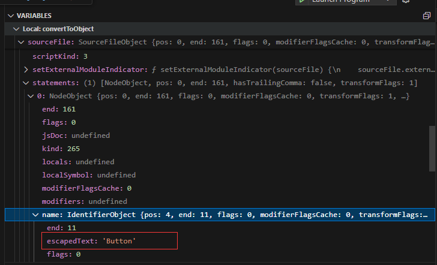

# TypeScript Compiler Project

## Overview

This project is a TypeScript compiler that converts TypeScript type definitions into JavaScript object literals using standard Typescript compiler api. It started with the `createSourceFile` API from the TypeScript Compiler API and involved debugging to observe the structure of a standardized `typeStr` input.

## Key Features

- Converts TypeScript type definitions into JavaScript object literals.
- Utilizes the TypeScript Compiler API for parsing and analyzing TypeScript code.
- Supports various TypeScript types, including union types.

## Sample input and output

the sample input and output 
Sample input:

```typescript
const typeStr = `type Button = {
    variant: "solid" | "text" | "outlined";
};`;
console.log(convertToObject(typeStr));
```
Sample output:
```typescript
{
  Button: {
    variant: [ 'solid', 'text', 'outlined' ],
  }
}
```

## Explore progress

1. After some reading of the official api document, found createSourceFile is the ideal api to build the AST.
2. After the AST is built, inspect the structure of the AST, define the target type defined path.
3. Debug and Analyze the AST structure


